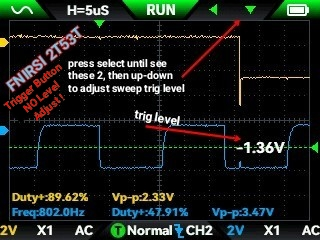

## i2cQuaternion
Connecting i2c sensors to an esp32 is fun but my favorite are the orientation sensors. This is about one sensor which does a lot of work by itself you would otherwise need to code [use a library] for: **sensor fusion**.  Sensor fusion literally *is* rocket science, but this project is not, and I made every effort to make it understandable.  
### Introduction to this project  
This project codes an Esp32s3 connected to an **IMU** [see below] to get quaternion data many times per second and **display it as yaw/pitch/roll**, with magnetic compass direction for **yaw**. The physical device for this costs about $35 in parts and is very compact.      
- My next TODO is to add **BLE** [bluetooth low energy] which will send a notification with a new quaternion when available.  This means that you write a ReactJS web app (using ThreeJS for example) which gets a stream of quaternions over BLE. You don't have to know a thing about C++, freeRTOS and all the stuff I'm about to detail. ThreeJS likes quaternions also.  
### More about this code  
- The **IMU** (**I**ntertial **M**easurment **U**nit) chip is a **TDK ICM-20948**. This chip has a **DMP** [**D**igital **M**otion **P**rocessor] which it uses to convert raw gyro, accelerometer and compass data into useful orientation yaw/pitch/roll without the need for separate **sensor fusion** coding.        
Many times per second, the **IMU** raises its **hardware interrupt** pin high to alert the esp32 of an updated quaternion.  
Use of **interrupts** brings in the need for threads[tasks], semaphores and mutex'es, all features of a **realtime operating system**. This is taken care of by **freeRTOS**, built right into the esp32s3 and used by this code.     
- Programming language **C++** is used instead of modern ones like Java or Typescript because of it's close coupling to **memory and hardware**.    
- ⛵ These concepts are a bit hard to wrap my head around, so that's why I use sailboats, sailing ships, boatswain's whistle and sometimes starships to help visualize my understanding and make writing more fun. Such comments tagged with: ⛵.  
- A test app [esp32_code/src/TDK_dmp_demo/DmpTest.cpp](esp32_code/src/TDK_dmp_demo/DmpTest.cpp) shows how to use this library. It invokes helper functions/libraries to obtain quaternion data. It prints data as yaw/pitch/roll to the Serial output (monitor).  As data-ready events are generated by the **IMU**, the test app does not use its own ```loop()``` function for control. The library notifies the test app via a **callback function** supplied as an instantiation parameter.
- This is a **platformIO** project within **Visual Studio Code**.   
  Currently does not address calibration of the **IMU** device, essential for proper use. That's on my TODO list after setting up BLE access.    
- see https://product.tdk.com/en/search/sensor/mortion-inertial/imu/info?part_no=ICM-20948 for the vendor's description.  Optionally, download it's PDF datasheet which shows all it's internal registers and how to set them for features such as enabling the **DMP**.  
This chip typically purchased by hobbyists on a "breakout board" with support hardware (power supply, level shifters, solder pads etc).   
**Note:** I have had bad luck with no-name breakout boards; a brand name board is suggested.  
   
#### More about **quaternion:** 
- They're popular and your phone's already using it for games, gestures: the Web API's **AbsoluteOrientationSensor** provides them from the phone's sensor fusion, and so does the Android developer's API.   
- it's a set of 4 float values. Easily converted to roll/pitch.yaw **"euler angles"** "oiler" for display or troubleshooting. Popular 3D libraries such as Three.js and OpenGL take quaternions as a parameter for orienting models, lights or cameras. 
- **Gimbal Lock:** Quaternions are less susceptible to **Gimbal Lock** then euler angles. Example: On your flight sim points you point the plane straight up and the scene starts rapidly flipping back and forth 180 degrees. Also refer to the movies "Apollo 13", "Hidden Figures" for examples.    
  Quaternions use matrices and imaginary numbers and a stone bridge in Ireland is named after it. That's about how far my understanding goes and I'm ok with that. 

### Objective 
  - **Toy Sailing Drone** ⛵ is a tentative goal for this project to make it easier to for me to visualize.  Captain and crew appear in the following representing threads, events and stuff.  
For the forseeable future, an actual sailing drone is not happening, although it sounds like fun. 

### How this system works  
- First there is a clock driving updates done by the DMP on the chip.   
It's timing is set by ```setDMPODRrate()```.   
When data is ready (at regular intervals set above) the INT (Interrupt) pin goes high, effectively sounding the boatswain's whistle which the captain hears and acts upon.
- Handling hardware interrupts: arduino code senses a designated physical interrupt pin (this one raised by the **DMP**) to trigger a specific **Interrupt Service Routine (ISR)** tied to it. [a function]
  - we can read the sensor and handle the data now, **but we don't** because the processor captain is **very busy** running the ship and **can't be interrupted**, such as responding instantly to user input or updating graphics or avoiding a reef.
- instead, **freeRTOS** saves the day by assigning work to the sailors:
  - "**R**eal **T**ime **O**perating **S**ystem" is builtin to the esp32 and enables **tasks** (aka **threads** aka sailors), and **semaphores**. Threads are like sailors carrying out shipboard tasks and semaphores are like spoken orders directed to a sailor by name, shouted out loud over the wind and waves.     
  *[semaphores & mutex's are are nothing new, covered in classes the 80's at UW-Madison]*
  - **Interrupt** mechanism works in 2 steps here:  
    - a **worker task** sailor running in an endless loop, which **STOPS AND WAITS** 99% of the time. It waits for a freeRTOS **task notification**, a form of semaphore [captain calls the sailor's name]. This task does not block anything because it's in its own thread.  The sailor waits but does not sleep because it needs to detect it's semaphore!    
    - When an interrupt happens and the designated INT pin goes high, boatswain's whistle is blown with a certain tune to signal DSP data is ready to be obtained.  The captain hears it and runs the proper **ISR** where she decides what to do. In the **ISR**, the captain sends a freeRTOS **task notification** [calls out sailor's name and details] to the **worker task**. This unblocks the worker task to do it's thing, or in the captain's words, "make it so".  This lets the captain immediately return to running the ship without delay, to look out for the next asteroid to avoid.
In i2c, only the "captain" can initiate an exchange.    
    - Now the **worker task** gets its semaphore notification [hears it's name], unblocks, and takes it's time to query the DMP over i2c for current data and act on it, including moving servos etc. When done, it goes back to the blocked state, waiting again. 
- **UH OH!** 2 threads access i2c simultaneously === Crash Computer === Flying Dutchman  
  Yes, the esp32 crashes when this happens.  
  - This is where openRTOS **semaphores** used as **mutex** [mutual exclusion] come into play.   
  - At startup, this app sets up **one SemaphoreHandle_t object** for the **i2c bus** and is passed to all objects using the i2c bus.  
    This guarantees one-at-a-time access. [think the conch shell in the shipwreck movie]  
    ```xSemaphoreTake(xSemaphore, blockTime)``` will **block** until xSemaphore becomes available.  
    ```xSemaphoreGive(xSemaphore)``` must be called to   
  **release the semaphore**.    
  If not done the system locks up and sailor gets an Albatross to wear.  
   *try-catch exception handler is needed to release the semaphore if runtime error prevents its release.*
  - I may be wrong but BLE **B**luetooth **L**ow **E**nergy takes care of its own concurrency.
- Boatswain's whistle can also heard aboard starships to alert the captain into action.   

### Libraries and Helper Classes
- Look in platformio.ini ship's manifest to see the published library used to access the chip. 
- I added helper functions, organized as those tied to specific hardware and universal use:  
Structure of /lib:   
```
    lib/myLib
        |     \
     helpers   hdwreHelpers
       /  \             |
  i2chelper.cpp    TDK_dmp_helper.cpp
  Mathhelper.cpp   [interrupt & semaphore here]
  and more
```

### C++ vs Java, Typescript  
- The esp32 code here uses the ancient C++ language which I used before I heard of Java; I learned it from a **book**.  
- C++'s  distictive **pointers** and **address-of** operators aka sharks are versatile and dangerous but provide it with specific control over hardware needed for this system.  They reference locations in physical memory, unheard of in Java. 
### My experience with AI  
- Use AI to help learn C++. Ask it the right questions and it will help sort out confusion about C++.  Best to learn from a book and use AI as a coach.  
It makes great short coding examples, but tends to **bury simple code beneath layers of indirection** and **wrappers it invents**. It may even hide C++ features in wrappers to look like java, to make you happy. Try to use prompts to avoid this.  
- AI was terrible at writing code to set the chip's registers (it will look up reference tables, but the wrong ones), and insists its code is great, even after "correcting" problems you point out.  
- AI wrote functioning BLE code by ignoring the BLE framework and inventing its own send/receive protocol on top of the real protocol. I followed its example until I realized nothing on the internet used that "protocol". 

### Monitoring i2c and interrupt using Oscilloscope 
- Strictly optional; it's fun to get to hardware and see what's really happening on the wires. OK to do on a $30 system, maybe not on a real computer.  
- Here's a trace of the **i2c bus** as saved by the scope in memory:  
  Top trace is data pin; bottom is clock pin. Images show effect of pullup resistor on i2c. Note that spikiness is probably caused by capacitance in the test leads. Pullups appear to be necessary, as the corners are less rounded but not very much:  

  &nbsp;&nbsp;&nbsp;   

Notes for oscilloscope: FNRSI 2T53T 
- Sweep Trigger level: "trigger" button won't actually adjust trigger, use "select" button instead as follows:   

    


## VSCode settings:  
Here are settings I find useful. "sameLine" tells the code-format feature not to put newline after open brace (takes too much space)  
I have these here for when I setup a different computer and have forgotten all the settings...    
```
# settings.json in .vscode for project 
# or for user: (?)  ~/.config/Code/User/settings.json
{
    "C_Cpp.formatting": "vcFormat",
    "C_Cpp.vcFormat.newLine.beforeOpenBrace.function": "sameLine"
}
```
## VSCode notes about platformIO project folder vs GitHub location: 
* In windows disable "hide hidden folders" in file manager to you can **see** the **.git folders**.  
* During development, I sometimes have many independent unrelated projects in subfolders, all inside one GitHub repo. I do that so everything can be backed up in one place.    
* in vscode platformIO (for esp32, not reactjs), need to point platformIO to one of the projects, using filesystem location. Note that this is **independent** from the GitHub repo project location.
* After copying an existing project into a github repo, be sure to **delete the .git folder**. 

