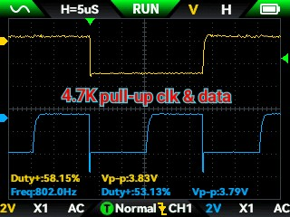
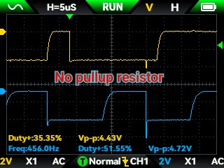

### Objective
- demo arduino app for esp32s3 which uses the TDK ICM-20948 Digital Motion Processor   
  It's a gyro, accelerometer and compass combined with a *navigation computer* "DMP" all on a chip  
  Typically purchased on a "breakout board" with support hardware (power supply, level shifters, solder pads etc)  
  https://product.tdk.com/en/search/sensor/mortion-inertial/imu/info?part_no=ICM-20948
- I'd like to think I could build a sailing drone; not very possible but makes a good working goal.  

### Overview of system presented here
- Orientation data is calculated at intervals by the chip, based on the 3 sensors, using a "sensor fusion" algorithm. This performed by the chip, and is very complex. 
- Output of system is in the form of a **quaternion**. Think of it as a relative of x,y,z euler angles, but more versatile, but less understandable. For output, I transform it to euler angles because they are intuitive for people to look at. 
  - Quaternions can be fed right into 3D graphics systems like ThreeJS and OpenGL. (not SGI GL, however). 
  - Quaternions are less susceptible to **Gimbal Lock**. Example: flight sim suddenly turning 180degrees or losing your balance when looking straight up. Also refer to the movie "Apollo 13" for a dramatic example.    
- Quaternions use matrices and imaginary numbers and a stone bridge in Ireland is named after it. That's all I'll say. 
### How it works  
- First there is a clock driving updates. This project uses the DMP on the chip to do it by raising the INT (Interrupt) pin high when new data is ready. It's timing is set by ```setDMPODRrate()```.   
  This maybe/can be used as the app clock, driving graphics updates etc.  
- arduino code senses the physical interrupt pin to trigger an **Interrupt Service Routine (ISR)**. [a function]
  - we can read the sensor and handle the data now, **but we don't** because the processor **can't be interrupted** because it has other realtime responsibilities, such as responding instantly to user input or updating graphics.  
  - a saildrone example needs to move servos (ie: rudder, sails) in real time.  A sailboat can quickly be blown off course by the wind and waves, especially a toy sailboat.   
- instead, **freeRTOS** saves the day:
  - "**R**eal **T**ime **O**perating **S**ystem" is builtin to the esp32 and enables **tasks** aka **threads**, and **semaphores**   
  *[nothing new: all covered way back in the 80's at UW-Madison]*
  - The ISR actually works in 2 parts:  
    - a **worker task** running in an endless loop, which **STOPS AND WAITS** 99% of the time. It waits for a freeRTOS **task notification**, a form of semaphore. This task does not block anything because it's in its own thread.    
    - The true **ISR** sends a **task notification** to the **worker task** when the INT pin goes high, then immediately returns main thread control.  
    - Now the **worker task** takes it time to query the DMP for current data and act on it, including moving servos etc. When done, it goes back to the blocked state, waiting again.  
- **UH OH!** 2 threads access i2c === Crash Computer === Flying Dutchman
  - This is where openRTOS **semaphores** used as **mutex** [mutual exclusion] come into play.   
  - The app sets up 2 **SemaphoreHandle_t** objects, one for the **i2c bus** and other for **Serial.printf()**.  
    These are passed to all objects used by the main app.   
    These guarantee one-at-a-time access. 
    ```xSemaphoreTake(xSemaphore, blockTime)``` will **block** until xSemaphore becomes available.  
    ```xSemaphoreGive(xSemaphore)``` must be called to **release the semaphore**. If not done, an Albatross is waiting for you. 
  - I may be wrong but BLE **B**luetooth **L**ow **E**nergy takes care of its own concurrency.  

### Libraries
- Look in platformio.ini to see the Sparkfun library used to access the chip. 
- I added helper functions, organized as those tied to specific hardware and universal use:  
Structure of /lib:   
```
    lib/myLib
        |     \
     helpers   hdwreHelpers
       /  \             |
  i2chelper.cpp    TDK_dmp_helper.cpp
  Mathhelper.cpp   [interrupt & semaphore here]
  and more
```

### Monitoring i2c and interrupt using Oscilloscope 
- This is not a necessary or typical part of a project of this type --but is fun to do. 
- My first breakout board was a no-name board which crashed the i2c bus now and then and would intermittently provide interrupts.   
I used it as an excuse to buy a 2-trace oscilloscope to analyze the i2c clock and data lines.   
I later got a "brand name" board which works perfectly.


I use oscilloscope FNRSI 2T53T 
- Trigger level: "trigger" button won't adust it, use "select" button instead as follows:   

    
- Effect of pullup resistor on i2c. Doesn't seem to be necessary:  

  &nbsp;&nbsp;&nbsp;   


## VSCode settings:  
Here are settings I find useful   
```
# settings.json in .vscode for project 
# or for user: (?)  ~/.config/Code/User/settings.json
{
    "C_Cpp.formatting": "vcFormat",
    "C_Cpp.vcFormat.newLine.beforeOpenBrace.function": "sameLine"
}
```
## VSCode notes about platformIO project folder vs GitHub location: 
* During development, I sometimes have many independent unrelated projects in subfolders, all inside one GitHub repo. I do that so everything can be backed up in one place.    
* in vscode platformIO (for esp32, not reactjs), need to point platformIO to one of the projects, using filesystem location.

